# GetAI: AI-Powered Barcode Scanner and Chatbot

## Overview

GetAI is an AI-powered barcode scanning system developed by our team for the A2SV Hackathon. Our goal is to provide comprehensive and understandable product information to consumers in Africa, addressing the gap in localized and easily accessible usage instructions, safety guidelines, and detailed descriptions.

## Problem Statement

Consumers in Africa face significant challenges in accessing detailed product information, especially in the beauty, healthcare, and food sectors. The lack of localized and easily accessible information can lead to improper product use, health risks, and a lack of consumer confidence. Furthermore, the absence of integration of local languages and cultural relevance complicates this issue, making it difficult for a diverse consumer base to make informed decisions.

## Solution

GetAI aims to solve these challenges by offering a user-friendly, AI-driven barcode scanning system that provides detailed product information in multiple local languages. Our solution ensures accessibility, safety, and enhanced consumer trust by delivering comprehensive information about products, including:

- Usage instructions
- Safety guidelines
- Ingredient lists
- Similar product recommendations
- Locally made alternatives

## Current Methods of Gathering Product Information

Currently, consumers in Africa rely on various methods to gather product information due to the lack of comprehensive solutions like GetAI:

- **Manual Online Searches**: Time-consuming and often yielding inaccurate or incomplete results.
- **Manufacturer Websites**: Limited information and often difficult to navigate.
- **Word of Mouth**: Recommendations from friends, family, or online reviews, which can be inconsistent.
- **Retail Store Assistance**: Dependent on the knowledge of retail staff, which can vary.
- **Social Media Influencers**: Influencer reviews may not be comprehensive or unbiased.
- **Local Market Knowledge**: Reliance on community recommendations, particularly in rural or less digitally connected areas.

These methods highlight the gaps in accessing comprehensive, standardized, and easily accessible product information, underscoring the need for a robust solution like GetAI.

## Why Choose GetAI?

Consumers should choose GetAI over alternative methods for several reasons:

- **Comprehensive Information**: Advanced AI and LLM technology provide detailed usage instructions, safety guidelines, ingredient lists, similar products, and locally made alternatives.
- **Multilingual Support**: Support for multiple local languages ensures accessibility to a diverse user base across Africa.
- **Accuracy and Reliability**: AI-powered system delivers accurate and real-time information, eliminating inconsistencies.
- **Ease of Use**: Simple barcode scanning functionality and intuitive interface design.
- **Empowerment through Knowledge**: Detailed product information helps consumers make informed decisions, promotes safety, and supports local businesses.
- **Accessibility**: mobile-friendly design ensure accessibility in areas with internet connectivity.

## Target Customer Segments

- **Consumers across Africa**: Seeking detailed product information for health, beauty, and household items.
- **Retailers and Distributors**: Enhancing customer experience by providing comprehensive product details and promoting locally made alternatives.
- **Government Agencies and Regulatory Bodies**: Promoting consumer safety and ensuring compliance through accessible product information.
- **Non-Governmental Organizations (NGOs)**: Empowering communities with product knowledge.
- **Mobile Network Operators (MNOs)**: Offering value-added services through USSD integration, expanding reach to users without smartphones or internet access.


## PURPOSE OF THE PROJECT
The purpose of the GetAI project is to create an AI-powered barcode scanner and chatbot that helps people in Africa easily access important product information. Many consumers in Africa struggle to find clear and detailed information about products, especially in the areas of beauty, healthcare, and food. This lack of information can lead to improper product use and health risks. GetAI aims to solve this problem by providing a simple way for users to scan barcodes and receive comprehensive product details in their local languages. This includes usage instructions, safety guidelines, ingredient lists, and even suggestions for similar products or local alternatives. The goal is to make product information accessible, accurate, and relevant, empowering consumers to make informed and safe choices

## STRUCTURE OF THE PROJECT

1. **User Interface**

**Mobile App**
The user interface of the GetAI app is designed to be user-friendly and intuitive. Users interact with the app by opening it on their smartphone, where they are greeted with a clean and simple splash screen.
<p>

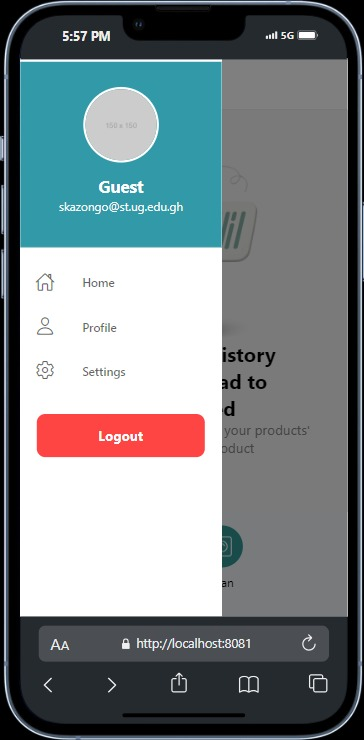
</p>

The app then guides them through account setup, which includes creating an account, verifying their phone number, and entering personal details.
<p align="center">
  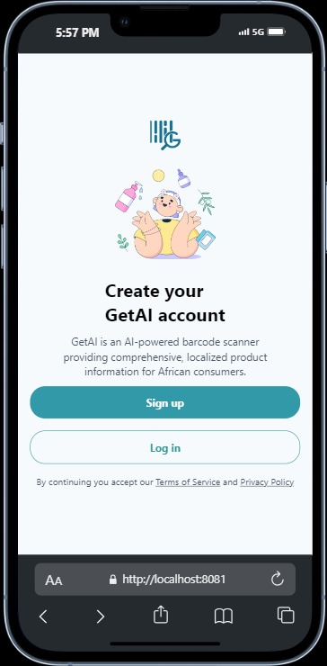
  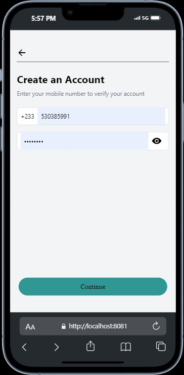
  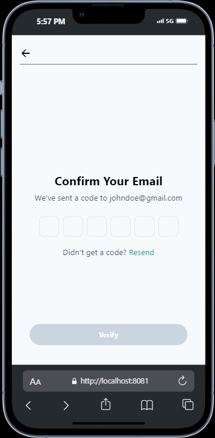
  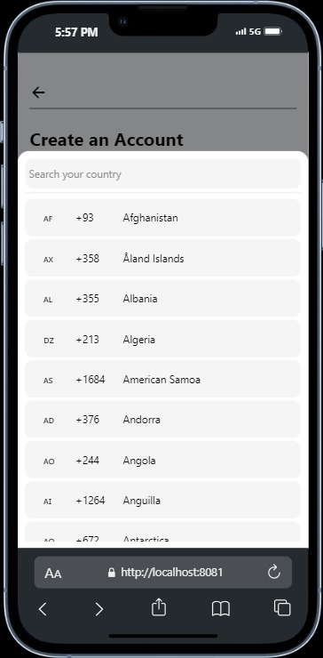
</p>

<p align="center">
  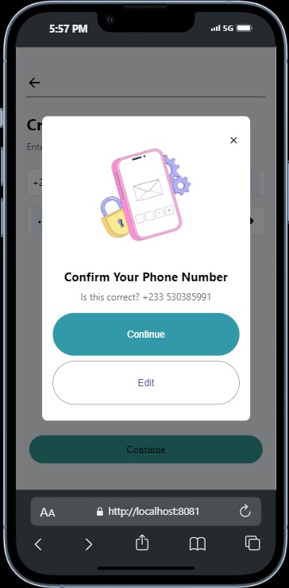
  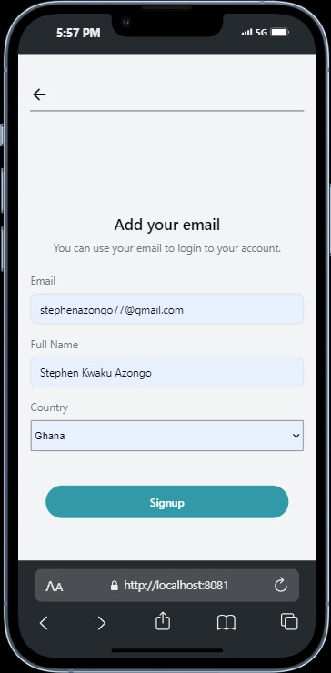
  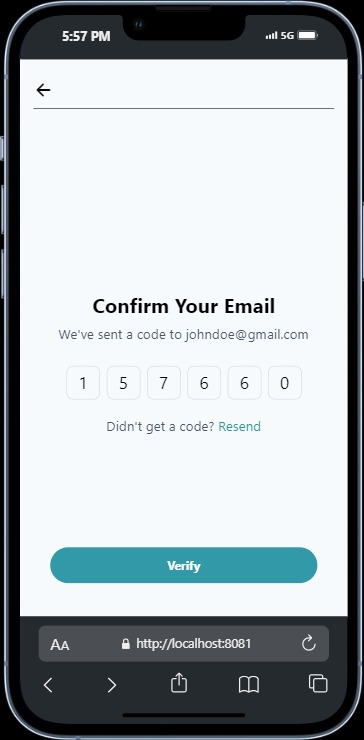
  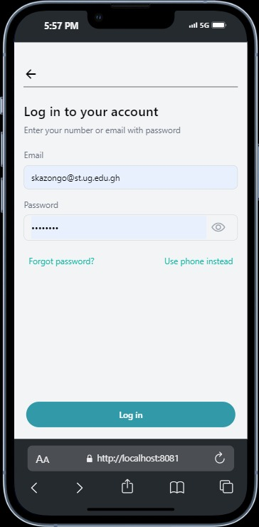
</p>

Once inside the app, users can scan product barcodes using their smartphone camera. The barcode scanning process is straightforward, with a dedicated scanning screen that provides clear visual feedback, indicating when the barcode is correctly captured. After scanning, the app quickly retrieves and displays detailed product information, such as usage instructions and safety guidelines.

<p align="center">
  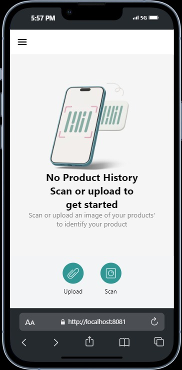
  
  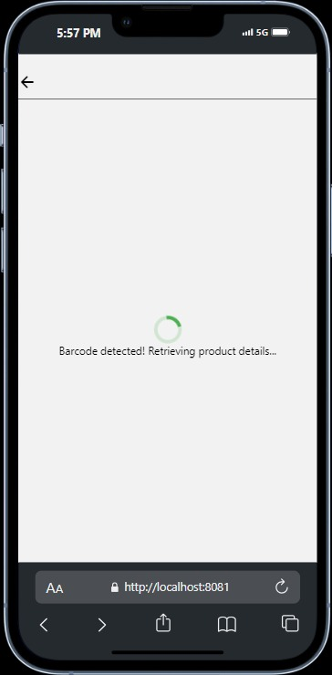
   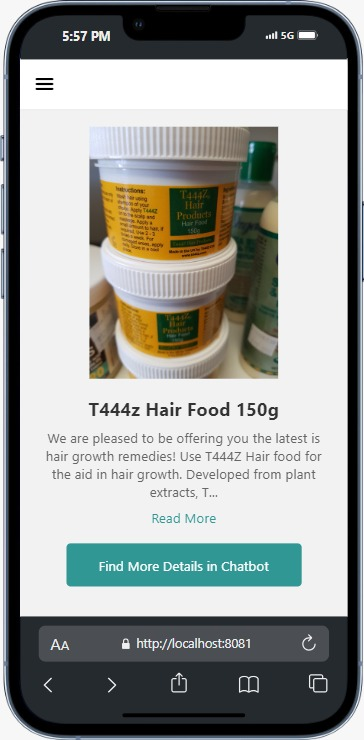
</p>

The app also includes a navigation menu  that allows users to easily access different features, such as their product history, settings, and additional resources.

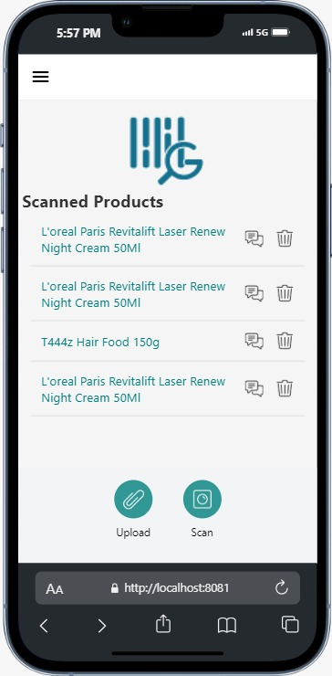
<!--  -->


**2. Barcode Scanning Module**

 **Scanning Technology**:Our system utilizes the camera on a smartphone to scan barcodes. The camera captures the barcode image, and advanced image processing algorithms are employed to accurately decode the barcode, ensuring that even low-quality images or distorted barcodes can be read effectively.

  **Data Extraction**: Once the barcode is scanned, the system reads the encoded data and retrieves the relevant product information from our database. The application cross-references the barcode with entries in our MongoDB database to pull up detailed product information. If the product isn't found in the database, alternative methods like external API queries or web scraping are triggered to provide the user with relevant information. This ensures that users receive accurate and timely product data, regardless of the barcode source.

  **3. AI-Powered Product Information Retrieval**
  1. **AI Integration**: Our system apply AI models to interpret and provide accurate product information. By utilizing generative AI, the system can analyze barcode data and cross-reference it with our database to pull detailed product information. The AI models are trained to recognize product categories, interpret ingredient lists, and provide safety guidelines based on the scanned barcode. If the product isn't found in our database, AI assists in fetching relevant information from alternative sources, ensuring that users always have access to accurate and reliable data.

  2. **Product Database**: All product information is stored in a well-organized MongoDB database. This database includes comprehensive details such as usage instructions, safety guidelines, ingredient lists, and other relevant information. The database is continuously updated with new products, ensuring that users receive the most current and accurate data. Additionally, the database is designed to handle large volumes of data efficiently, allowing for quick retrieval and processing of information.

**4. Backend Infrastructure**

**5. Feedback and Improvement Loop**
**Feedback Collection**: Users can provide feedback through various channels, such as in-app feedback forms, surveys, and direct support interactions. This feedback is used to identify areas for improvement and to address user concerns.
**Feedback Analysis**: Collected feedback is analyzed to detect common issues and trends. This analysis helps in prioritizing enhancements and addressing user needs effectively.
AI Learning:

**Regular Updates**: The AI models are regularly updated with new data to improve their accuracy and performance. This includes incorporating user interactions, feedback, and new information to keep the models current and effective.
Training and Refinement: Continuous training and refinement of AI models are conducted to enhance their learning capabilities. This process involves using advanced machine learning techniques and data from diverse sources to improve the AI’s ability to provide relevant and accurate information.

## HOW OUR CHOOSEN GENERATIVE AI MODEL ARE SOLVING THE PROBLEM
We selected (our model) to help solve the problem of providing detailed, accessible product information to consumers in Africa. Here's how this our model addresses the challenges:
    **Providing Accurate Information:**
        The AI is capable of processing vast amounts of data and generating accurate and reliable product details. When a user scans a barcode, the AI quickly pulls up relevant information, such as how to use the product, its ingredients, and safety guidelines.

    **Answering User Questions:**
        The AI is not just limited to providing preset information; it can also answer specific questions that users might have about a product. For example, if someone wants to know whether a product contains a certain ingredient, the AI can generate that information on the spot.

    **Ease of Use:**
        The AI makes the app easy to use by guiding users through the process of scanning barcodes and finding information. Its ability to generate natural, conversational responses means that users don't need any technical knowledge to interact with it.

    **Multilanguage Accessibility:**
        To make the app accessible to users across different regions, we will integrate an API that supports multiple local languages. This ensures that users can access product information in a language they are comfortable with, regardless of where they are located.


## Installation and Setup

To get started with GetAI, follow these steps to install the necessary libraries and tools:

1. **Ensure Python 3.x is installed on your machine**:
    - Download and install Python from the [official website](https://www.python.org/downloads/).

2. **Install FastAPI**:
    - FastAPI is required for building the backend of our application. Install it using pip:
      ```sh
      pip install fastapi==0.70.0
      ```

3. **Install Streamlit**:
    - Streamlit is used for creating the front-end of our application. Install it using pip:
      ```sh
      pip install streamlit==1.3.0
      ```

4. **Install other dependencies**:
    - You may also need to install additional libraries. You can find all required dependencies in the `requirements.txt` file. Install them using:
      ```sh
      pip install -r requirements.txt
      ```

5. **Run the application**:
    - To start the application, navigate to the project directory and run:
      ```sh
      streamlit run app.py
      ```

For detailed installation instructions and troubleshooting, refer to our [documentation](#).

## Contributing

Currently, GetAI is not an open-source project. However, we welcome contributions from partners and collaborators who share our vision of enhancing consumer access to product information in Africa.

If you are interested in contributing to our project, please contact us at [contact@getai.com](Obimbaking@gmail.com) for more information on partnership opportunities and collaboration.

We look forward to working with like-minded individuals and organizations to further our mission.

## Authors
- Adeniran Owolabi 
- Asya Haji: nasbyhajj18@gmail.com
- Ismael Muzemil: ismael.mdev@gmail.com
- Obimba Joshua - Obimbaking@gmail.com
- Stephen Kwaku Azongo - stephenazongo77@gmail.com


## Acknowledgements

A2SV for hosting the hackathon.
